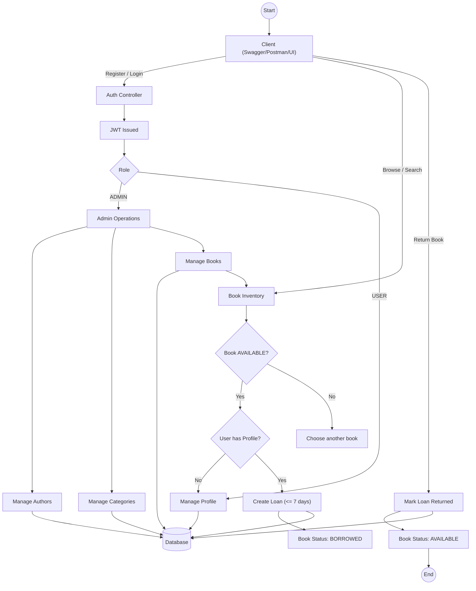

# Arisu Library Management System

## Flowchart

```mermaid
flowchart TD
	A((Start)) --> B["Client (Swagger/Postman/UI)"]
	B -->|Register / Login| C["Auth Controller"]
	C --> D["JWT Issued"]
	D --> E{Role}

	E -->|ADMIN| F["Admin Operations"]
	F --> F1["Manage Authors"]
	F --> F2["Manage Categories"]
	F --> F3["Manage Books"]
	F1 --> Z[(Database)]
	F2 --> Z
	F3 --> Z

	E -->|USER| G["Manage Profile"]
	G --> Z

	B -->|Browse / Search| H["Book Inventory"]
	F3 --> H
	H --> I{Book AVAILABLE?}

	I -- Yes --> J{User has Profile?}
	J -- No --> G
	J -- Yes --> K["Create Loan (<= 7 days)"]
	K --> L["Book Status: BORROWED"]
	K --> Z
	I -- No --> M["Choose another book"]

	B -->|Return Book| N["Mark Loan Returned"]
	N --> O["Book Status: AVAILABLE"]
	N --> Z

	O --> P((End))
```

